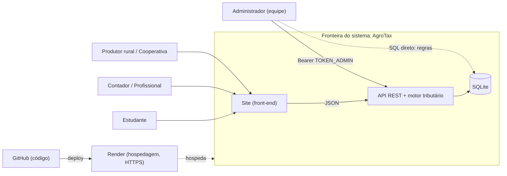
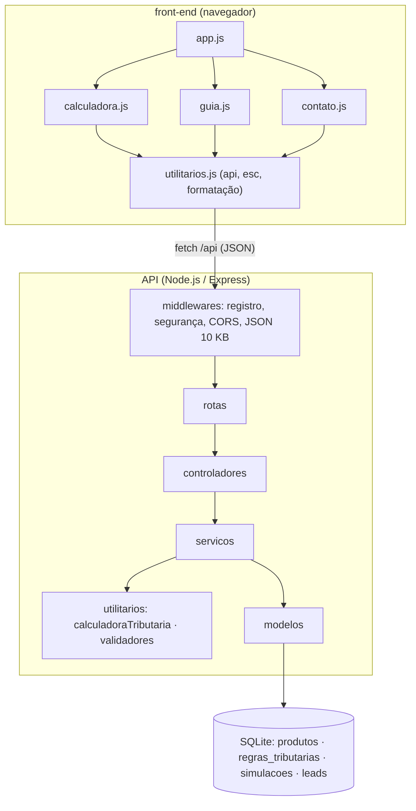
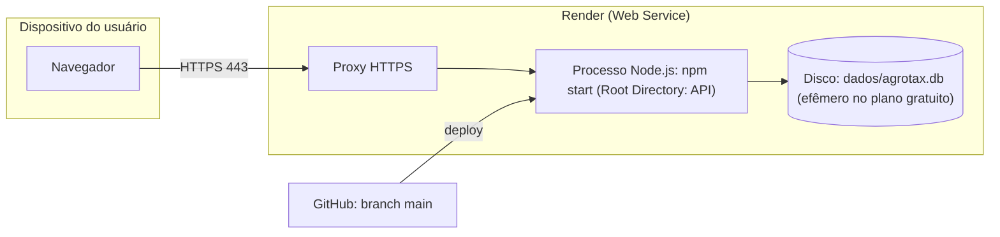

# Declaração de Escopo do Projeto — AgroTax

| Campo | Valor |
|---|---|
| **Projeto** | AgroTax — calculadora de estimativa tributária para o agronegócio |
| **Release** | 2.0.0 (`agrotax-api` 2.0.0) |
| **Versão do documento** | 1.0 |
| **Disciplina / Professor** | **[PREENCHER]** |
| **Equipe** | **[PREENCHER: nome e função de cada integrante]** |
| **Repositório** | **[PREENCHER: link do GitHub]** |
| **Protótipo online** | https://agrotax.onrender.com |
| **Idioma** | Português Brasileiro (pt-BR) |
| **Referências** | PMBOK Guide 7ª Ed. (escopo, EAP, partes interessadas, riscos); ISO/IEC/IEEE 29148:2018 (requisitos); ISO/IEC 25010 (qualidade de produto) |
| **Documentos relacionados** | `requisitos_de_usuario.md` (RU/UC), `historias_de_usuario.md` (HU), `requisitos_de_sistema.md` (RSF/RNF/L), `plano_de_testes.md`, `matriz_de_rastreabilidade.md` |

> **Nota metodológica.** Este documento descreve o sistema **como ele está implementado** no repositório. A coluna
> "Situação" dos módulos e requisitos foi conferida no código e nos **16 testes automatizados** (`npm test`).
> Itens que ainda não existem aparecem como **[PROPOSTO]**. Datas, responsáveis e esforço **não foram informados**
> pela equipe e, por isso, não são inventados aqui: estão marcados **[PREENCHER]**. As alíquotas da base inicial são
> **exemplos de demonstração**, não valores oficiais.

---

## Sumário

1. Justificativa de engenharia e objetivos SMART
2. Fronteiras do sistema e Diagrama de Contexto
3. Escopo do produto por módulos e entregáveis físicos
4. Diagrama de Componentes
5. Diagrama de Implantação
6. Estrutura Analítica do Projeto (EAP/WBS) e dicionário
7. Limites do projeto: dentro e fora do escopo
8. Matrizes: critérios de aceitação, restrições, premissas e riscos
9. Governança e controle de mudanças de escopo
10. Partes interessadas

---

## 1. Justificativa de engenharia e objetivos SMART

### 1.1 Problema e oportunidade

A carga tributária de uma operação agrícola depende do **produto**, do **regime tributário** do contribuinte
(Simples Nacional, Lucro Presumido, Lucro Real, Produtor Rural Pessoa Física) e do **tipo de operação**
(compra ou venda). Produtores rurais, cooperativas e pequenos escritórios costumam recorrer a planilhas ou consultas
avulsas para ter uma ideia do imposto envolvido. O AgroTax oferece uma **estimativa rápida, organizada e transparente**,
deixando claro que não substitui a análise de um contador.

### 1.2 Justificativa da stack Node.js + HTML5

| Decisão arquitetural | Justificativa de engenharia | Trade-off assumido |
|---|---|---|
| **Node.js (Event Loop, I/O não bloqueante)** | A carga é quase toda I/O (HTTP + SQL local) e cálculos leves; um único runtime (JavaScript) no cliente e no servidor reduz custo de manutenção para uma equipe pequena | Tarefas pesadas de CPU bloqueariam o processo; não há nenhuma hoje |
| **Express + camadas (rotas → controladores → serviços → modelos)** | Responsabilidades separadas, testáveis e fáceis de explicar | Mais arquivos do que um `server.js` único |
| **SQLite (better-sqlite3)** | Zero configuração, arquivo único, API síncrona simples, suficiente para o volume do projeto | Uma única instância de escrita; no Render gratuito o disco é efêmero (ver L-02) |
| **Motor tributário como função pura** | Testável sem banco nem HTTP; reaproveitável por outras interfaces | Recebe todas as regras em memória (aceitável para dezenas de regras) |
| **Regras versionadas por data** | A legislação muda; nova regra = nova linha, sem alterar código | Exige disciplina para fechar `vigente_ate` da regra antiga |
| **Front-end em HTML/CSS/JS puro (módulos ES)** | Sem etapa de build; carrega rápido e roda em qualquer hospedagem estática | Sem framework: o estado da tela é manual |
| **API e site no mesmo processo** | Uma única URL no deploy, sem problema de CORS em produção | Escala front e API juntos |

### 1.3 Objetivos SMART

| Código | Objetivo | Específico | Mensurável | Alcançável | Relevante | Prazo |
|---|---|---|---|---|---|---|
| OBJ-01 | Simular tributos de uma operação | ICMS, IPI, PIS, COFINS, Funrural e SENAR | Os 6 tributos aparecem em toda simulação (RSF04) | Motor puro e testado | Núcleo do produto | **[PREENCHER]** |
| OBJ-02 | Persistir os dados em banco | Produtos, regras, simulações e leads em SQLite | 4 tabelas, chaves estrangeiras e `CHECK` ativos; carga inicial idempotente | Biblioteca embutida | Resolve a crítica de "sem banco de dados" | **[PREENCHER]** |
| OBJ-03 | Manter alíquotas atualizáveis sem alterar código | Regras com `vigente_desde` e `vigente_ate` | Teste automatizado comprova troca de 12% para 18% em 2027 | Tabela única de regras | Legislação muda | **[PREENCHER]** |
| OBJ-04 | Proteger a aplicação | Validação, SQL parametrizado, CSP, limite por IP, CORS, token | 13 controles listados em `seguranca.md`; entradas inválidas retornam 400 sem gravar | Controles padrão do Express | Resolve a crítica de "sem segurança" | **[PREENCHER]** |
| OBJ-05 | Garantir qualidade verificável | Testes automatizados do motor, validadores e controladores | `npm test`: **16 passam, 0 falham** | Test runner nativo do Node | Evidência objetiva | **[PREENCHER]** |
| OBJ-06 | Documentar o sistema | Escopo, requisitos, histórias, testes, API, banco, segurança | 12 documentos em `documento/` + índice, README e guia do GitHub | Reaproveita o código existente | Resolve a crítica de "documentação ruim" | **[PREENCHER]** |
| OBJ-07 | Publicar e permitir execução por terceiros | Deploy no Render e scripts de inicialização | Outro integrante roda o sistema com `iniciar.bat`/`iniciar.sh` sem configuração extra | Scripts simples | Reprodutibilidade | **[PREENCHER]** |

---

## 2. Fronteiras do sistema e Diagrama de Contexto

**Dentro da fronteira:** site (front-end), API REST, motor tributário e banco SQLite.
**Fora da fronteira:** navegador do usuário, plataforma de hospedagem (Render), repositório (GitHub),
e-mail do usuário que envia contato.



| Entidade externa | Interface | Dados trocados |
|---|---|---|
| Usuário final (produtor, contador, estudante) | Navegador, HTTPS | Produto, valor, regime, operação → estimativa; nome, e-mail e mensagem de contato |
| Administrador | `GET /api/leads` com `Authorization: Bearer`; SQL no arquivo `.db` | Lista de contatos; novas regras tributárias |
| Render | Deploy a partir do GitHub; variáveis de ambiente | Código, `NODE_ENV`, `TOKEN_ADMIN` |
| GitHub | `git push` / pull request | Código-fonte e documentação |

Não há integração com SEFAZ, ERPs, gateways de pagamento ou serviços de e-mail.

---

## 3. Escopo do produto por módulos e entregáveis físicos

| Módulo | Entregáveis físicos | Requisitos | Situação |
|---|---|---|---|
| **M1 Calculadora** | `front-end/js/calculadora.js`, `API/src/rotas/calculadoraRotas.js`, `controladores/calculadoraControlador.js`, `servicos/calculadoraServico.js`, `utilitarios/calculadoraTributaria.js` | RU02–RU05, RSF01–RSF05 | Implementado e testado |
| **M2 Guia Fiscal** | `front-end/js/guia.js`, `rotas/guiaRotas.js`, `controladores/guiaControlador.js`, `servicos/guiaServico.js` | RU06, RSF07 | Implementado e testado |
| **M3 Contato (leads)** | `front-end/js/contato.js`, `rotas/leadRotas.js`, `controladores/leadControlador.js`, `servicos/leadServico.js`, `modelos/leadModelo.js` | RU07, RU09, RSF08–RSF10 | Implementado e testado |
| **M4 Histórico de simulações** | `modelos/simulacaoModelo.js`, `GET /api/calculos/:id` | RU08, RSF05–RSF06 | Implementado e testado (somente via API) |
| **M5 Dados** | `API/banco/schema.sql`, `dados_iniciais.sql`, `iniciarBanco.js`, `config/conexaoBanco.js`, `modelos/*` | RSF11 | Implementado e testado |
| **M6 Segurança** | `middlewares/seguranca.js`, `limitadorRequisicoes.js`, `autenticacaoAdmin.js`, `erros.js`, `utilitarios/validadores.js` | RNF-SEG01–SEG10 | Implementado; controles de borda sem teste HTTP (L-08) |
| **M7 Observabilidade** | `middlewares/registroRequisicoes.js` | RSF14 | Implementado (sem teste automatizado) |
| **M8 Front-end institucional** | `front-end/index.html`, `css/estilo.css`, `js/app.js`, `js/utilitarios.js`, `assets/` | RU01, RU11, RU12 | Implementado (verificação manual pendente) |
| **M9 Execução e deploy** | `iniciar.bat`, `iniciar.sh`, `iniciar.command`, `.env.example`, `package.json` | OBJ-07 | Implementado (sintaxe verificada; execução em Windows/macOS não testada pela IA) |
| **M10 Documentação** | `README.md`, `PASSO_A_PASSO_GITHUB.md`, `documento/*.md` | OBJ-06 | Implementado |
| **M11 Painel administrativo** | — | RU10 | **[PROPOSTO]** (hoje as regras são alteradas por SQL) |

### 3.1 Estrutura física de entregáveis

```
AgroTax/
├── API/
│   ├── banco/              schema.sql · dados_iniciais.sql
│   ├── dados/              (arquivo .db gerado em execução; fora do Git)
│   ├── src/
│   │   ├── config/         ambiente.js · conexaoBanco.js · constantes.js
│   │   ├── controladores/  calculadora · guia · lead
│   │   ├── middlewares/    seguranca · limitadorRequisicoes · autenticacaoAdmin · erros · registroRequisicoes
│   │   ├── modelos/        produto · regra · simulacao · lead
│   │   ├── rotas/          calculadoraRotas · guiaRotas · leadRotas
│   │   ├── servicos/       calculadoraServico · guiaServico · leadServico
│   │   ├── utilitarios/    calculadoraTributaria · validadores
│   │   ├── app.js · server.js
│   ├── testes/             3 arquivos, 16 testes
│   ├── iniciarBanco.js · package.json · .env.example · .gitignore
├── front-end/              index.html · css/ · js/ · assets/
├── documento/              (este conjunto de documentos)
├── iniciar.bat · iniciar.sh · iniciar.command
├── PASSO_A_PASSO_GITHUB.md · README.md · CHANGELOG.md · .gitignore
```

---

## 4. Diagrama de Componentes



| Componente | Interface oferecida | Interface requerida |
|---|---|---|
| `calculadoraTributaria` | `calcularTributos(entrada)` → resultado | Nenhuma (função pura) |
| `validadores` | `validarSimulacao(corpo)`, `validarLead(corpo)` | `config/constantes` |
| `servicos/*` | `simular`, `listarTributosVigentes`, `registrar`, `listar` | `modelos`, `utilitarios` |
| `modelos/*` | Funções de leitura e escrita (únicas com SQL) | `config/conexaoBanco` |
| `rotas/*` | URLs HTTP | `controladores`, `middlewares` |
| `front-end/js/utilitarios.js` | `api(caminho, opções)`, `esc`, `dinheiro`, `porcento`, `aviso` | `fetch` do navegador |

---

## 5. Diagrama de Implantação



| Ambiente | Como sobe | Observações |
|---|---|---|
| **Desenvolvimento** | `iniciar.bat` / `iniciar.sh` / `iniciar.command` ou `cd API && npm run dev` | Porta 3000; também funciona com Live Server (porta 5500), com CORS liberado para `localhost:5500` |
| **Testes** | `cd API && npm test` | Banco `:memory:`; não toca no arquivo real |
| **Produção** | Render: Root `API`, Build `npm install`, Start `npm start`, `NODE_ENV=production` | CORS fechado (mesma origem); HSTS ligado; `trust proxy` = 1 |

---

## 6. Estrutura Analítica do Projeto (EAP/WBS) e dicionário

```
1 AgroTax
├── 1.1 Gestão
│   ├── 1.1.1 Declaração de escopo
│   └── 1.1.2 Controle de mudanças (CHANGELOG)
├── 1.2 Banco de dados
│   ├── 1.2.1 Modelagem (4 tabelas)
│   ├── 1.2.2 Script de estrutura (schema.sql)
│   └── 1.2.3 Carga inicial (dados_iniciais.sql, iniciarBanco.js)
├── 1.3 API
│   ├── 1.3.1 Motor tributário
│   ├── 1.3.2 Rotas, controladores, serviços e modelos
│   └── 1.3.3 Validação e tratamento de erros
├── 1.4 Front-end
│   ├── 1.4.1 Página, estilos e responsividade
│   └── 1.4.2 Módulos JS (calculadora, guia, contato)
├── 1.5 Segurança
│   ├── 1.5.1 Cabeçalhos, CORS, limite de requisições
│   └── 1.5.2 Autenticação por token da área administrativa
├── 1.6 Qualidade
│   ├── 1.6.1 Testes automatizados (16)
│   └── 1.6.2 Plano de testes e verificação manual
├── 1.7 Documentação
│   ├── 1.7.1 Requisitos (usuário e sistema), histórias e rastreabilidade
│   └── 1.7.2 README, guia do GitHub, decisões arquiteturais, manual do usuário
└── 1.8 Publicação
    ├── 1.8.1 Scripts de inicialização
    └── 1.8.2 Deploy no Render
```

| Pacote | Entregável | Critério de conclusão | Responsável | Prazo |
|---|---|---|---|---|
| 1.2 | `schema.sql`, `dados_iniciais.sql` | Rodar duas vezes não duplica dados (teste `controladores.test.js`) | **[PREENCHER]** | **[PREENCHER]** |
| 1.3 | Código em `API/src` | Rotas respondem conforme `api.md`; testes passam | **[PREENCHER]** | **[PREENCHER]** |
| 1.4 | `front-end/` | Simulação e contato funcionam em celular e computador | **[PREENCHER]** | **[PREENCHER]** |
| 1.5 | `middlewares/` | Itens de `seguranca.md` presentes | **[PREENCHER]** | **[PREENCHER]** |
| 1.6 | `API/testes/` e `plano_de_testes.md` | 16/16 testes; casos manuais executados e registrados | **[PREENCHER]** | **[PREENCHER]** |
| 1.7 | `documento/` | Matriz de rastreabilidade sem requisito órfão | **[PREENCHER]** | **[PREENCHER]** |
| 1.8 | Site no ar e scripts | `iniciar.*` sobe o sistema; site responde em `/api/saude` | **[PREENCHER]** | **[PREENCHER]** |

---

## 7. Limites do projeto: dentro e fora do escopo

### 7.1 Dentro

| Área | Entregas |
|---|---|
| Calculadora | Produto, valor, regime e operação → valor de cada tributo, total, valor líquido e carga tributária (%) |
| Guia Fiscal | Descrição de cada tributo e faixa de alíquotas vigentes (lidas do banco) |
| Contato | Formulário que grava mensagens no banco, com proteção contra spam |
| Histórico | Cada simulação é salva e consultável por identificador (API) |
| Dados | Banco SQLite com regras versionadas por data |
| Segurança | Validação, SQL parametrizado, CSP e demais cabeçalhos, limite por IP, CORS, token administrativo |
| Qualidade | Testes automatizados, plano de testes, rastreabilidade |
| Documentação e execução | Documentos, README, scripts `iniciar.*`, guia do GitHub |

### 7.2 Fora

| Item | Motivo |
|---|---|
| Cálculo oficial, emissão de nota ou guia de recolhimento | O sistema entrega **estimativas** |
| Alíquotas completas por estado, NCM e situação | A base inicial usa valores de exemplo; exige fonte oficial e revisão de contador |
| Créditos de PIS/COFINS, diferimento, substituição tributária, reforma tributária (IBS/CBS) | Complexidade fiscal além do escopo acadêmico |
| Cadastro e login de usuários | Não há dados privados por usuário nesta versão |
| Painel administrativo gráfico | **[PROPOSTO]**; hoje as regras mudam por SQL |
| Aplicativo mobile, integrações (SEFAZ, ERP), envio de e-mail | Não solicitados |
| Alta disponibilidade, banco distribuído, backup automático | Fora do porte do projeto |

---

## 8. Matrizes

### 8.1 Critérios de aceitação

| ID | Critério | Como verificar | Resultado esperado |
|---|---|---|---|
| CA-01 | Sistema sobe sem configuração | `iniciar.bat` ou `iniciar.sh` | Servidor em `http://localhost:3000`; banco criado sozinho |
| CA-02 | Testes passam | `cd API && npm test` | 16 aprovados, 0 reprovados |
| CA-03 | Simulação de referência | R$ 100.000, Soja, Produtor Rural PF, Venda | Total R$ 13.500,00 (13,5%): ICMS 12%, Funrural 1,3%, SENAR 0,2% |
| CA-04 | Entrada inválida é rejeitada | Valor negativo, regime inexistente, e-mail inválido | HTTP 400; nada é gravado |
| CA-05 | Regra versionada | Regra de ICMS 12% até 2026-12-31 e 18% a partir de 2027-01-01 | Simulação em 2026 usa 12%; em 2027, 18% |
| CA-06 | Área administrativa protegida | `GET /api/leads` sem token | 401 (ou 404 se `TOKEN_ADMIN` estiver vazio) |
| CA-07 | Banco idempotente | Iniciar o banco duas vezes | 5 produtos e 12 regras, sem duplicar |
| CA-08 | Segredos fora do Git | `git status` após `npm start` | `.env` e `dados/agrotax.db` não aparecem |
| CA-09 | Documentação completa | Matriz de rastreabilidade | Todo RU e RSF tem origem, implementação e teste ou lacuna registrada |

### 8.2 Restrições

| ID | Restrição |
|---|---|
| RES-01 | Runtime Node.js 18 ou superior |
| RES-02 | Banco SQLite em arquivo único (uma instância) |
| RES-03 | Plano gratuito do Render: disco efêmero e hibernação por inatividade |
| RES-04 | Projeto acadêmico: prazo e equipe definidos pela disciplina (**[PREENCHER]**) |
| RES-05 | Sem acesso a fonte oficial de alíquotas integrada: valores cadastrados manualmente |

### 8.3 Premissas

| ID | Premissa |
|---|---|
| PRE-01 | O usuário entende que o resultado é uma estimativa |
| PRE-02 | O volume de acessos é baixo (demonstração acadêmica) |
| PRE-03 | O Render termina o TLS (HTTPS) na frente da aplicação |
| PRE-04 | Um contador revisará as alíquotas antes de qualquer uso real |
| PRE-05 | O valor da operação é informado em reais, com até 2 casas decimais |

### 8.4 Riscos

Escala: Probabilidade (P) e Impacto (I) em Baixa/Média/Alta, avaliação qualitativa da equipe de desenvolvimento.

| ID | Risco | P | I | Mitigação | Registro |
|---|---|---|---|---|---|
| R-01 | Alíquotas de exemplo interpretadas como oficiais | Média | Alta | Aviso em todas as telas; revisão por contador; regras versionadas | L-01 |
| R-02 | Perda de dados a cada deploy (disco efêmero) | Alta | Média | Disco persistente ou PostgreSQL | L-02 |
| R-03 | Legislação muda e o sistema fica desatualizado | Alta | Média | Regras por data; processo de atualização documentado | `banco-de-dados.md` |
| R-04 | Spam ou abuso nas rotas públicas | Média | Média | Limite por IP, honeypot, corpo limitado a 10 KB | RNF-SEG05 |
| R-05 | Vazamento do `.env` ou do token | Baixa | Alta | `.gitignore`, `.env.example`, troca imediata do token | `PASSO_A_PASSO_GITHUB.md` |
| R-06 | Falha ao subir em máquina de outro integrante | Média | Média | Scripts `iniciar.*` com verificação de Node e criação do `.env` | M9 |
| R-07 | Dados pessoais de contato sem política formal (LGPD) | Média | Média | Aviso no formulário; coletar só nome, e-mail e mensagem; política formal pendente | L-11 |
| R-08 | Erro de arredondamento nos valores | Baixa | Média | Cálculo em centavos inteiros; teste dedicado | RSF04 |

---

## 9. Governança e controle de mudanças de escopo

1. **Pedido de mudança:** qualquer integrante registra a proposta (o que, por quê, impacto) em *Issue* do GitHub.
2. **Análise:** avalia-se o impacto em requisitos, banco, API, testes e documentos (usar a `matriz_de_rastreabilidade.md`).
3. **Decisão:** a equipe aprova, adia ou rejeita. Mudanças que alteram a nota de uma entrega são combinadas com o professor.
4. **Execução:** alteração em *branch* própria, com testes e documentação atualizados no mesmo *pull request*.
5. **Registro:** entrada no `CHANGELOG.md` e atualização do número de versão (versionamento semântico: maior = quebra de compatibilidade, menor = funcionalidade nova, correção = ajuste).
6. **Mudança de regra tributária:** não é mudança de escopo; é atualização de dados (inserir nova regra em `regras_tributarias`).

| Tipo de alteração | Quem aprova | Onde se registra |
|---|---|---|
| Novo requisito ou módulo | Equipe + professor (se afetar a avaliação) | Issue, escopo, CHANGELOG |
| Ajuste de interface ou texto | Qualquer integrante, via *pull request* revisado | CHANGELOG |
| Nova alíquota ou mudança de vigência | Integrante responsável pelos dados, com revisão de contador | `dados_iniciais.sql` ou SQL de migração |
| Correção de defeito | Qualquer integrante | CHANGELOG |

---

## 10. Partes interessadas

| Parte | Interesse | Influência | Como se relaciona |
|---|---|---|---|
| Professor / avaliador | Atender critérios da disciplina (banco, back-end, front-end, documentação, segurança) | Alta | Avalia as entregas |
| Equipe de desenvolvimento **[PREENCHER]** | Entregar e aprender | Alta | Constrói e mantém |
| Produtores rurais e cooperativas | Estimativa rápida e simples | Média | Usuários finais |
| Contadores e profissionais | Apoio e clareza dos tributos | Média | Usuários finais e potenciais revisores das alíquotas |
| Estudantes | Aprender tributação agrícola | Baixa | Usuários finais |
| Render (hospedagem) | Termos de uso do plano gratuito | Média | Fornecedor de infraestrutura |
| GitHub | Hospedar o código | Baixa | Fornecedor de versionamento |
