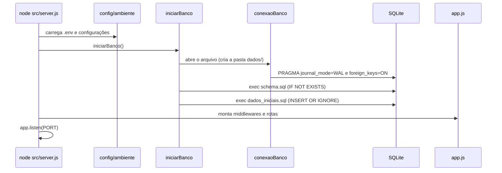
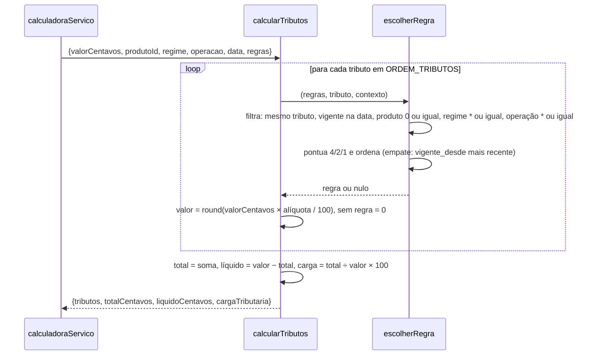
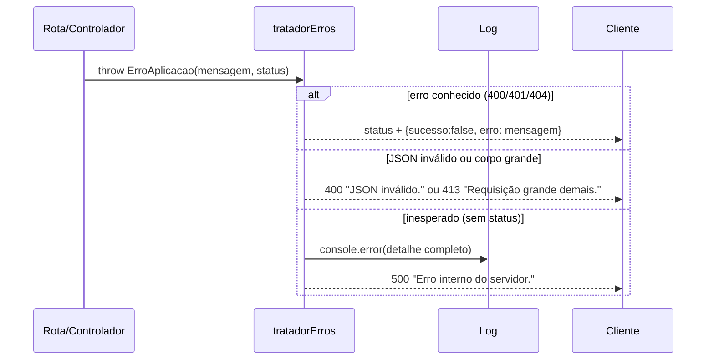
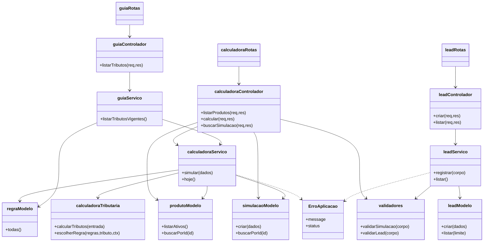
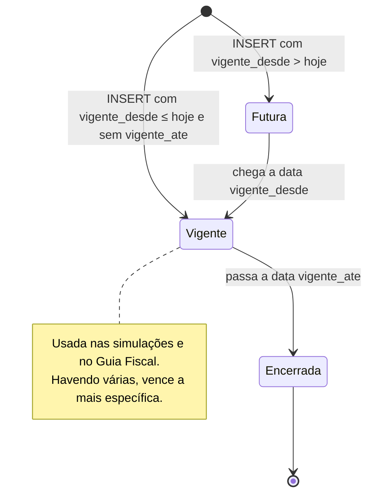
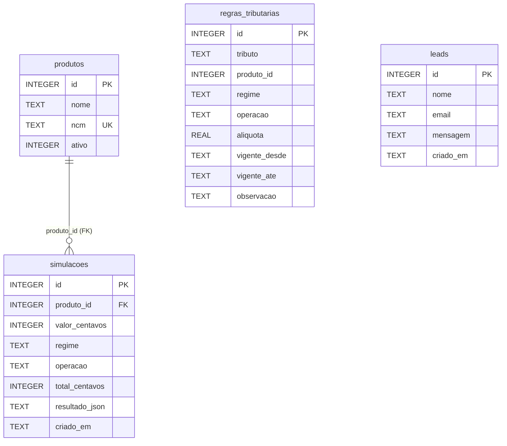

# Documento de Requisitos de Sistema — AgroTax

| Campo | Valor |
|---|---|
| **Sistema** | AgroTax — API REST + site estático servidos por um único processo Node.js |
| **Versão do documento** | 1.0 |
| **Versão do sistema analisado** | `agrotax-api` 2.0.0 (`engines.node` ≥ 18) |
| **Normas de referência** | ISO/IEC/IEEE 29148:2018 (requisitos); ISO/IEC 25010 (qualidade de produto); UML 2.5.1 (diagramas em Mermaid); OWASP Top 10 (checagem de segurança) |
| **Idioma** | Português Brasileiro (pt-BR) |
| **Documentos relacionados** | `requisitos_de_usuario.md` (RU/UC), `historias_de_usuario.md` (HU), `escopo_do_projeto.md`, `plano_de_testes.md`, `matriz_de_rastreabilidade.md`, `api.md`, `banco-de-dados.md`, `seguranca.md` |

> **Nota metodológica.** Itens descritos como **Implementado** foram conferidos no código-fonte. "Testado" significa
> coberto por pelo menos um dos **16 testes automatizados** (`API/testes`). Os testes exercitam o motor, os validadores,
> os serviços/controladores e o banco (SQLite em memória); **não sobem o servidor HTTP**, então middlewares de borda
> (cabeçalhos, limite de requisições, CORS) estão **implementados, mas sem teste automatizado** (lacuna L-08).
> O banco de dados é **SQLite** (`better-sqlite3`). Itens **[PROPOSTO]** não existem no código. Metas de desempenho são
> **metas**, não medições.

---

## Sumário

1. Arquitetura de runtime e pilha tecnológica
2. Requisitos Funcionais de Sistema (RSF)
3. Requisitos Não Funcionais (RNF) — ISO/IEC 25010
4. Diagramas de sequência do back-end
5. Diagrama de classes (módulos) e dependências
6. Máquina de estados da regra tributária
7. Dicionário técnico de dados (DDL)
8. Contratos de API RESTful e matriz de rastreabilidade
9. Registro de lacunas e dívida técnica (L-01 … L-18)

---

## 1. Arquitetura de runtime e pilha tecnológica

### 1.1 Pilha

| Camada | Tecnologia | Versão (`package.json`) | Papel |
|---|---|---|---|
| Runtime | Node.js | ≥ 18 | Event Loop single-thread, I/O não bloqueante |
| Servidor HTTP | Express | ^4.19.2 | Roteamento, middlewares, arquivos estáticos |
| CORS | cors | ^2.8.5 | Libera apenas origens configuradas |
| Configuração | dotenv | ^16.4.5 | Lê `API/.env` |
| Banco | better-sqlite3 | ^11.3.0 | SQLite síncrono e embutido |
| Cabeçalhos de segurança | código próprio | — | `middlewares/seguranca.js` (CSP etc.; sem a biblioteca helmet) |
| Limite de requisições | código próprio | — | `middlewares/limitadorRequisicoes.js` (em memória; sem express-rate-limit) |
| Validação | código próprio | — | `utilitarios/validadores.js` (sem Joi/Zod) |
| Autenticação administrativa | `crypto` nativo | — | Token estático em tempo constante (sem JWT) |
| Testes | `node:test` | nativo | Executa com `npm test` |
| Front-end | HTML5, CSS3, JavaScript (ES modules) | — | Sem framework e sem etapa de build |

Quatro dependências de produção, nenhuma de desenvolvimento.

### 1.2 Pipeline de uma requisição (ordem real em `app.js`)

```
requisição
 → registroRequisicoes   (gera X-Request-Id, loga ao terminar)
 → seguranca             (CSP, nosniff, frame deny, referrer, permissions; HSTS em produção)
 → cors                  (origens permitidas)
 → express.json 10 KB
 → /api/saude | /api (calculadoraRotas, guiaRotas, leadRotas)   [limitador e autenticação por rota]
 → /api (naoEncontrado → 404)
 → express.static(front-end)
 → tratadorErros         (400/401/404/413/429/500 em JSON)
```

### 1.3 Variáveis de ambiente

| Variável | Padrão | Efeito |
|---|---|---|
| `PORT` | 3000 | Porta HTTP |
| `NODE_ENV` | — | `production` liga HSTS e fecha o CORS quando `CORS_ORIGIN` está vazio |
| `CORS_ORIGIN` | vazio | Lista separada por vírgula. Vazio em desenvolvimento = `localhost:5500` e `127.0.0.1:5500`; vazio em produção = nenhuma origem externa |
| `ARQUIVO_BANCO` | `dados/agrotax.db` | Caminho do SQLite (relativo a `API/`) ou `:memory:` |
| `TOKEN_ADMIN` | vazio | Vazio desativa `GET /api/leads` (404) |

### 1.4 Convenções de resposta

Sucesso: `{ "sucesso": true, "dados": ... }`. Erro: `{ "sucesso": false, "erro": "mensagem" }`.
Valores monetários trafegam em **centavos inteiros**; o front-end formata em reais.

---

## 2. Requisitos Funcionais de Sistema (RSF)

| ID | Requisito | Origem (RU) | Implementação | Teste | Situação |
|---|---|---|---|---|---|
| RSF01 | O sistema deve listar os produtos ativos, ordenados por nome | RU02 | `produtoModelo.listarAtivos`, `GET /api/produtos` | `controladores.test` (lista 5 produtos) | Implementado e testado |
| RSF02 | O sistema deve validar a simulação: `produtoId` inteiro > 0; `valor` número finito de 0,01 a 1e12; `regime` e `operacao` nas listas oficiais | RU03, RU12 | `validadores.validarSimulacao` | `validadores.test` (rejeita 7 casos, inclusive tentativa de SQL injection no id) | Implementado e testado |
| RSF03 | Para cada tributo, o sistema deve escolher a regra vigente na data e a mais específica (produto > regime > operação; empate: a mais recente) | RU04, RU10 | `calculadoraTributaria.escolherRegra` | `calculadoraTributaria.test` (vigência, produto vence geral) | Implementado e testado |
| RSF04 | O sistema deve calcular, em centavos inteiros, os 6 tributos (ICMS, IPI, PIS, COFINS, Funrural, SENAR), o total, o valor líquido e a carga tributária (%); tributo sem regra = 0 com observação "Sem regra cadastrada" | RU04 | `calculadoraTributaria.calcularTributos` | `calculadoraTributaria.test` (valores e tributo sem regra), `controladores.test` | Implementado e testado |
| RSF05 | O sistema deve persistir cada simulação (valores em centavos e resultado completo em JSON) | RU04 | `calculadoraServico.simular`, `simulacaoModelo.criar` | `controladores.test` | Implementado e testado |
| RSF06 | O sistema deve consultar uma simulação por id; id inexistente ou não numérico = 404 | RU08 | `calculadoraControlador.buscarSimulacao` | `controladores.test` | Implementado e testado |
| RSF07 | O sistema deve fornecer, para cada tributo, rótulo, descrição e menor e maior alíquota **vigentes hoje** | RU06 | `guiaServico.listarTributosVigentes` | `controladores.test` (6 tributos; ICMS mínima 12) | Implementado e testado |
| RSF08 | O sistema deve validar e gravar contatos: nome 2–100; e-mail válido de até 254 caracteres, em minúsculas; mensagem 5–1000; espaços das pontas removidos | RU07 | `validadores.validarLead`, `leadServico.registrar` | `validadores.test`, `controladores.test` | Implementado e testado |
| RSF09 | O sistema deve responder sucesso e **não gravar** contato cujo campo escondido `site` esteja preenchido | RU07 | `leadServico.registrar` | `validadores.test`, `controladores.test` | Implementado e testado |
| RSF10 | O sistema deve listar até 100 contatos, do mais recente ao mais antigo, apenas com token válido | RU09 | `autenticacaoAdmin`, `leadModelo.listar` | `controladores.test` (token correto, errado e ausente) | Implementado e testado |
| RSF11 | Ao iniciar, o sistema deve criar tabelas e dados iniciais sem duplicar, mesmo se executado várias vezes | RU10 | `iniciarBanco`, `schema.sql`, `dados_iniciais.sql` | `controladores.test` (executa 2 vezes) | Implementado e testado |
| RSF12 | O sistema deve servir o front-end estático na mesma origem da API | RU01 | `app.js` (`express.static`) | — | Implementado (sem teste) |
| RSF13 | O sistema deve expor `GET /api/saude` | — | `app.js` | — | Implementado (sem teste) |
| RSF14 | O sistema deve registrar um log por requisição com id, data, método, rota (sem query string), status e duração, e devolver `X-Request-Id`; **não** registra o corpo | — | `registroRequisicoes.js` | — | Implementado (sem teste) |
| RSF15 | O sistema deve devolver erros em JSON padronizado com status adequado: 400, 401, 404, 413, 429, 500 (detalhe do 500 só no log) | RU12 | `erros.js` | parcial (`controladores.test` verifica os status lançados) | Implementado (tratador sem teste HTTP) |
| RSF16 | O sistema deve limitar requisições por IP: `POST /api/calculos` 60/min; `POST /api/leads` 5/hora | RU12 | `limitadorRequisicoes.js` | — | Implementado (sem teste) |
| RSF17 | O sistema deve enviar cabeçalhos de segurança em todas as respostas | — | `seguranca.js` | — | Implementado (sem teste) |
| RSF18 | O sistema deve aceitar chamadas entre origens somente das origens configuradas | — | `app.js` (`cors`) | — | Implementado (sem teste) |
| RSF19 | O sistema deve permitir cadastro de produtos e regras por interface | RU10 | — | — | **[PROPOSTO]** |
| RSF20 | O sistema deve exibir o id da simulação e permitir exportá-la em PDF | RU13, RU14 | — | — | **[PROPOSTO]** |

---

## 3. Requisitos Não Funcionais (RNF) — ISO/IEC 25010

### 3.1 Adequação funcional
| ID | Requisito | Verificação | Situação |
|---|---|---|---|
| RNF-FUN01 | Cálculos monetários sem erro de ponto flutuante (centavos inteiros e `Math.round`) | `calculadoraTributaria.test` ("arredonda…") | Implementado e testado |
| RNF-FUN02 | Resultado de referência: R$ 100.000 de Soja, Produtor Rural PF, Venda = R$ 13.500,00 (13,5%) | `controladores.test` | Implementado e testado |

### 3.2 Eficiência de desempenho
| ID | Requisito | Situação |
|---|---|---|
| RNF-DES01 | **Meta:** a simulação responde em menos de 500 ms em condições normais (SQLite local, dezenas de regras) | **Meta, não medida** |
| RNF-DES02 | Corpo de requisição limitado a 10 KB | Implementado |

### 3.3 Compatibilidade
| ID | Requisito | Situação |
|---|---|---|
| RNF-COM01 | Executar em Node.js 18 ou superior (`engines`) | Implementado |
| RNF-COM02 | Navegadores com suporte a ES modules e `fetch` | Implementado (sem teste em navegadores específicos) |

### 3.4 Usabilidade
| ID | Requisito | Evidência | Situação |
|---|---|---|---|
| RNF-USA01 | Layout responsivo; abaixo de 820 px o formulário e o resultado empilham | `estilo.css` (`@media (max-width: 820px)`) | Implementado (verificação manual pendente) |
| RNF-USA02 | Foco visível em links, botões e campos | `:focus-visible` com contorno | Implementado |
| RNF-USA03 | Resultado e avisos anunciados a leitores de tela | `aria-live="polite"` no resultado e no aviso | Implementado |
| RNF-USA04 | Respeitar preferência de movimento reduzido | `prefers-reduced-motion` | Implementado |
| RNF-USA05 | Campos com rótulo, `lang="pt-BR"` e tipos adequados (`number`, `email`) | `index.html` | Implementado |
| RNF-USA06 | Aviso de estimativa em todas as telas de resultado | `index.html`, `calculadora.js` | Implementado |

### 3.5 Confiabilidade
| ID | Requisito | Situação |
|---|---|---|
| RNF-CON01 | Inicialização do banco idempotente | Implementado e testado |
| RNF-CON02 | Chaves estrangeiras ativas (`PRAGMA foreign_keys = ON`) e modo WAL | Implementado |
| RNF-CON03 | Restrições `CHECK` no banco (alíquota 0–100, tributo válido, valor > 0, ativo 0/1) | Implementado |
| RNF-CON04 | Erro em controlador não derruba o processo: o tratador devolve 500 genérico | Implementado (sem teste HTTP) |
| RNF-CON05 | Persistência no Render gratuito | **Não atendido** (disco efêmero, L-02) |

### 3.6 Segurança
| ID | Requisito | Mitigação | Situação |
|---|---|---|---|
| RNF-SEG01 | Validar toda entrada no servidor | `validadores.js` | Implementado e testado |
| RNF-SEG02 | Prevenir SQL injection | Consultas com parâmetros `?` em todos os modelos | Implementado (revisão de código) |
| RNF-SEG03 | Prevenir XSS | `esc()` em todo texto vindo da API; CSP sem `unsafe-inline` | Implementado |
| RNF-SEG04 | Prevenir clickjacking e sniffing | `X-Frame-Options: DENY`, `frame-ancestors 'none'`, `nosniff` | Implementado (sem teste) |
| RNF-SEG05 | Mitigar abuso e spam | Limite por IP, honeypot, corpo ≤ 10 KB | Implementado (parte testada) |
| RNF-SEG06 | Restringir chamadas entre origens | CORS por lista | Implementado (sem teste) |
| RNF-SEG07 | Proteger a área administrativa | Bearer token, comparação com `timingSafeEqual`, área desativada sem token | Implementado e testado |
| RNF-SEG08 | Não vazar detalhes internos | 500 genérico; detalhe só no log | Implementado |
| RNF-SEG09 | Manter segredos fora do Git | `.gitignore` (`.env`, `dados/*`, `*.db`) | Implementado |
| RNF-SEG10 | Forçar HTTPS em produção | HSTS com `NODE_ENV=production`; TLS no Render | Implementado |
| RNF-SEG11 | Não expor tecnologia | `x-powered-by` desativado | Implementado |

### 3.7 Manutenibilidade
| ID | Requisito | Situação |
|---|---|---|
| RNF-MAN01 | Camadas separadas: rotas → controladores → serviços → modelos; SQL somente em `modelos/` e `iniciarBanco.js` | Implementado |
| RNF-MAN02 | Motor tributário como função pura, sem Express e sem banco | Implementado e testado |
| RNF-MAN03 | Regras tributárias em dados, não em código | Implementado e testado |
| RNF-MAN04 | Documentação atualizada junto com o código (DoD em `historias_de_usuario.md`) | Processo |

### 3.8 Portabilidade
| ID | Requisito | Situação |
|---|---|---|
| RNF-POR01 | Subir com um comando em Windows, Linux e macOS | Scripts `iniciar.*` (sintaxe verificada; execução não testada pela IA) |
| RNF-POR02 | Sem etapa de build no front-end | Implementado |

### 3.9 Privacidade e observabilidade
| ID | Requisito | Situação |
|---|---|---|
| RNF-PRI01 | Coletar apenas nome, e-mail e mensagem; sem cookies e sem rastreadores | Implementado |
| RNF-PRI02 | Aviso de uso dos dados no formulário | Implementado |
| RNF-PRI03 | O navegador baixa fontes do Google Fonts (terceiro recebe o IP do visitante) | Implementado; ver L-12 |
| RNF-OBS01 | Log estruturado por requisição, sem corpo | Implementado |

---

## 4. Diagramas de sequência do back-end

Os fluxos de usuário (carregar página, simular, contato, listar leads, atualizar regra) estão em
`requisitos_de_usuario.md`, DS-01 a DS-05. Aqui estão os fluxos internos.

### DS-B1 — Inicialização do servidor



### DS-B2 — Escolha de regras e cálculo (motor)



### DS-B3 — Tratamento de erros



---

## 5. Diagrama de classes (módulos) e dependências

O código é funcional (módulos CommonJS), não orientado a objetos; o diagrama usa cada módulo como "classe" com suas funções públicas. A única classe real é `ErroAplicacao`.



> Observação: `calculadoraControlador` acessa dois modelos diretamente (listar produtos e buscar simulação), atalho que contorna a camada de serviço (L-13).

---

## 6. Máquina de estados da regra tributária

O estado **não é gravado**: é derivado da data atual e das colunas `vigente_desde` e `vigente_ate`.



| Estado | Condição | Uso |
|---|---|---|
| Futura | `vigente_desde` > data | Ignorada |
| Vigente | `vigente_desde` ≤ data e (`vigente_ate` nulo ou data ≤ `vigente_ate`) | Entra no cálculo e no guia |
| Encerrada | data > `vigente_ate` | Ignorada; permanece para histórico |

---

## 7. Dicionário técnico de dados (DDL)

Fonte: `API/banco/schema.sql`. Dialeto: **SQLite**.



> `regras_tributarias.produto_id` **não** é chave estrangeira: o valor 0 significa "todos os produtos".

### 7.1 `produtos`
| Coluna | Tipo | Nulo | Padrão | Restrição |
|---|---|---|---|---|
| id | INTEGER | não | autoincremento | PK |
| nome | TEXT | não | — | — |
| ncm | TEXT | não | — | UNIQUE |
| ativo | INTEGER | não | 1 | CHECK (0 ou 1) |

### 7.2 `regras_tributarias`
| Coluna | Tipo | Nulo | Padrão | Restrição |
|---|---|---|---|---|
| id | INTEGER | não | autoincremento | PK |
| tributo | TEXT | não | — | CHECK em ICMS, IPI, PIS, COFINS, FUNRURAL, SENAR |
| produto_id | INTEGER | não | 0 | 0 = todos |
| regime | TEXT | não | `*` | `*` = todos |
| operacao | TEXT | não | `*` | `*` = todas |
| aliquota | REAL | não | — | CHECK 0 ≤ valor ≤ 100 |
| vigente_desde | TEXT | não | — | data AAAA-MM-DD |
| vigente_ate | TEXT | sim | — | nulo = em vigor |
| observacao | TEXT | sim | — | exibida ao usuário |
| | | | | UNIQUE (tributo, produto_id, regime, operacao, vigente_desde) |

### 7.3 `simulacoes`
| Coluna | Tipo | Nulo | Padrão | Restrição |
|---|---|---|---|---|
| id | INTEGER | não | autoincremento | PK |
| produto_id | INTEGER | não | — | FK → produtos(id) |
| valor_centavos | INTEGER | não | — | CHECK > 0 |
| regime | TEXT | não | — | — |
| operacao | TEXT | não | — | — |
| total_centavos | INTEGER | não | — | — |
| resultado_json | TEXT | não | — | JSON do resultado completo |
| criado_em | TEXT | não | `datetime('now')` | UTC |
| | | | | Índice `idx_simulacoes_criado_em (criado_em)` |

### 7.4 `leads`
| Coluna | Tipo | Nulo | Padrão | Restrição |
|---|---|---|---|---|
| id | INTEGER | não | autoincremento | PK |
| nome | TEXT | não | — | — |
| email | TEXT | não | — | — |
| mensagem | TEXT | não | — | — |
| criado_em | TEXT | não | `datetime('now')` | UTC |

### 7.5 Dados iniciais (`dados_iniciais.sql`) — **valores de exemplo**
5 produtos (Soja em grão, Milho em grão, Café cru em grão, Boi gordo, Leite in natura) e 12 regras:
ICMS 12% e IPI 0% para todos; PIS/COFINS por regime (Lucro Presumido 0,65% e 3%; Lucro Real 1,65% e 7,6%; Simples Nacional e Produtor Rural PF 0%); Funrural 1,3% e SENAR 0,2% apenas para Produtor Rural PF em Venda.

---

## 8. Contratos de API RESTful e matriz de rastreabilidade

Base: `/api` · JSON · UTF-8.

### 8.1 Tabela de endpoints

| Método | Rota | Acesso | Limite | Sucesso | Erros | RSF |
|---|---|---|---|---|---|---|
| GET | `/api/saude` | público | — | 200 | — | RSF13 |
| GET | `/api/produtos` | público | — | 200 | 500 | RSF01 |
| GET | `/api/tributos` | público | — | 200 | 500 | RSF07 |
| POST | `/api/calculos` | público | 60/min/IP | 201 | 400, 404, 413, 429, 500 | RSF02–RSF05 |
| GET | `/api/calculos/:id` | público | — | 200 | 404 | RSF06 |
| POST | `/api/leads` | público | 5/h/IP | 201 | 400, 413, 429 | RSF08, RSF09 |
| GET | `/api/leads` | **Bearer token** | — | 200 | 401, 404 | RSF10 |

### 8.2 Exemplos reais

**GET `/api/saude`** → `200`
```json
{ "sucesso": true, "dados": { "status": "ok" } }
```

**GET `/api/produtos`** → `200`
```json
{ "sucesso": true, "dados": [
  { "id": 4, "nome": "Boi gordo", "ncm": "0102.29.90" },
  { "id": 3, "nome": "Café cru em grão", "ncm": "0901.11.10" },
  { "id": 5, "nome": "Leite in natura", "ncm": "0401.20.10" },
  { "id": 2, "nome": "Milho em grão", "ncm": "1005.90.10" },
  { "id": 1, "nome": "Soja em grão", "ncm": "1201.90.00" }
] }
```

**GET `/api/tributos`** → `200` (trecho)
```json
{ "sucesso": true, "dados": [
  { "tributo": "ICMS", "rotulo": "ICMS",
    "descricao": "Tributo considerado pelo sistema conforme a alíquota cadastrada para o produto.",
    "aliquotaMinima": 12, "aliquotaMaxima": 12 },
  { "tributo": "PIS", "rotulo": "PIS",
    "descricao": "Contribuição calculada conforme o regime tributário informado.",
    "aliquotaMinima": 0, "aliquotaMaxima": 1.65 }
] }
```

**POST `/api/calculos`**

Requisição:
```json
{ "produtoId": 1, "valor": 100000, "regime": "Produtor Rural PF", "operacao": "Venda" }
```
Resposta `201`:
```json
{ "sucesso": true, "dados": {
  "id": 1,
  "produto": { "id": 1, "nome": "Soja em grão", "ncm": "1201.90.00" },
  "regimeTributario": "Produtor Rural PF",
  "tipoOperacao": "Venda",
  "valorCentavos": 10000000,
  "tributos": [
    { "tributo": "ICMS",     "aliquota": 12,  "valorCentavos": 1200000, "observacao": "Alíquota de referência (exemplo)" },
    { "tributo": "IPI",      "aliquota": 0,   "valorCentavos": 0,       "observacao": "Produto in natura costuma ser não tributado" },
    { "tributo": "PIS",      "aliquota": 0,   "valorCentavos": 0,       "observacao": "Não se aplica à pessoa física" },
    { "tributo": "COFINS",   "aliquota": 0,   "valorCentavos": 0,       "observacao": "Não se aplica à pessoa física" },
    { "tributo": "FUNRURAL", "aliquota": 1.3, "valorCentavos": 130000,  "observacao": "INSS 1,2% + RAT 0,1% sobre a receita bruta" },
    { "tributo": "SENAR",    "aliquota": 0.2, "valorCentavos": 20000,   "observacao": "Contribuição ao SENAR sobre a receita bruta" }
  ],
  "totalCentavos": 1350000,
  "liquidoCentavos": 8650000,
  "cargaTributaria": 13.5
} }
```
Erro `400`: `{ "sucesso": false, "erro": "Regime tributário inválido." }` (várias mensagens são unidas com espaço).

**GET `/api/calculos/:id`** → `200`: devolve a linha da tabela (`id`, `produto_id`, `valor_centavos`, `regime`, `operacao`, `total_centavos`, `resultado_json`, `criado_em`) **mais** o campo `resultado` já convertido em objeto (L-14).

**POST `/api/leads`**

Requisição:
```json
{ "nome": "Maria", "email": "maria@exemplo.com", "mensagem": "Quero saber mais.", "site": "" }
```
Resposta `201`: `{ "sucesso": true, "dados": { "mensagem": "Mensagem enviada! Entraremos em contato." } }`

**GET `/api/leads`** — cabeçalho `Authorization: Bearer <TOKEN_ADMIN>` → `200`: `{ "sucesso": true, "dados": [ { "id", "nome", "email", "mensagem", "criado_em" } ] }`

### 8.3 Matriz de rastreabilidade RU → RSF → código → teste

| RU | RSF | Arquivos principais | Testes |
|---|---|---|---|
| RU01 | RSF12 | `app.js`, `front-end/` | — |
| RU02 | RSF01 | `produtoModelo.js`, `calculadoraControlador.js` | `controladores.test` |
| RU03 | RSF02 | `validadores.js` | `validadores.test` |
| RU04 | RSF03, RSF04, RSF05 | `calculadoraTributaria.js`, `calculadoraServico.js`, `simulacaoModelo.js` | `calculadoraTributaria.test`, `controladores.test` |
| RU05 | — | `index.html`, `calculadora.js` | — |
| RU06 | RSF07 | `guiaServico.js` | `controladores.test` |
| RU07 | RSF08, RSF09 | `leadServico.js`, `validadores.js`, `leadModelo.js` | `validadores.test`, `controladores.test` |
| RU08 | RSF06 | `calculadoraControlador.js`, `simulacaoModelo.js` | `controladores.test` |
| RU09 | RSF10 | `autenticacaoAdmin.js`, `leadModelo.js` | `controladores.test` |
| RU10 | RSF03, RSF11 | `schema.sql`, `dados_iniciais.sql`, `iniciarBanco.js` | `calculadoraTributaria.test`, `controladores.test` |
| RU11 | — | `estilo.css` | — |
| RU12 | RSF15, RSF16 | `erros.js`, `limitadorRequisicoes.js` | parcial |

---

## 9. Registro de lacunas e dívida técnica

| ID | Lacuna ou dívida | Impacto | Sugestão | Risco (escopo) |
|---|---|---|---|---|
| L-01 | Alíquotas e produtos são **exemplos**; não há fonte oficial nem revisão de contador | Estimativa pode divergir da lei | Revisar com contador; cadastrar por estado e NCM | R-01 |
| L-02 | Disco efêmero no Render gratuito: leads e simulações somem a cada deploy | Perda de dados | Disco persistente ou PostgreSQL | R-02 |
| L-03 | Limitador de requisições em memória, janela fixa que zera por intervalo | Não vale com várias instâncias; permite rajada na virada da janela | Redis ou janela deslizante | — |
| L-04 | `GET /api/calculos/:id` sem autenticação e com id sequencial | Qualquer pessoa pode enumerar simulações (não contêm dados pessoais) | Ids aleatórios (UUID) ou autenticação | — |
| L-05 | Sem painel administrativo: regras mudam por SQL direto, sem auditoria | Erro humano e falta de rastro | Painel com login e tabela de auditoria | — |
| L-06 | `GET /api/leads` sem paginação (limite fixo de 100) e sem limitador | Não lista contatos antigos | Paginação por cursor | — |
| L-07 | Sem login de usuário e sem histórico por pessoa | Não há personalização | Autenticação (argon2/bcrypt) | — |
| L-08 | Testes não sobem o servidor HTTP: cabeçalhos, CORS, limitador, `static` e tratador de erros sem teste automatizado | Regressão silenciosa na camada de borda | Testes de integração com `fetch` ou supertest | — |
| L-09 | O token administrativo é um segredo estático, sem rotação nem registro de acessos | Vazamento exige troca manual | Rotação periódica; log de acesso | R-05 |
| L-10 | `trust proxy = 1` presume um único proxy (Render) | IP incorreto em outra topologia | Ajustar conforme o ambiente | — |
| L-11 | Sem política de privacidade formal (LGPD): retenção, base legal, exclusão de contatos | Conformidade pendente | Redigir política; rotina de exclusão | R-07 |
| L-12 | Fontes carregadas do Google Fonts (terceiro recebe o IP) e CSP libera esses domínios | Privacidade e dependência externa | Hospedar a fonte localmente | — |
| L-13 | `calculadoraControlador` acessa modelos diretamente (listar produtos, buscar simulação) | Quebra a regra "controlador não fala com o banco" | Mover para `calculadoraServico` | — |
| L-14 | `GET /api/calculos/:id` expõe nomes de colunas e duplica o resultado (`resultado_json` e `resultado`) | Contrato inconsistente com as demais rotas | Padronizar a resposta (camelCase) | — |
| L-15 | `hoje()` usa UTC: perto da meia-noite no Brasil pode escolher o dia seguinte | Regra vigente errada na virada de vigência | Usar fuso `America/Sao_Paulo` | — |
| L-16 | Lista de regimes e operações duplicada em `constantes.js` e `calculadora.js` | Risco de divergência | Expor `GET /api/opcoes` | — |
| L-17 | Modelo tributário simplificado: sem créditos de PIS/COFINS, diferimento, substituição tributária, base de cálculo especial | Resultado pode divergir do real | Documentado como fora do escopo | R-01 |
| L-18 | Sem backup do banco e sem monitoramento de disponibilidade | Perda e indisponibilidade não detectadas | Backup agendado; monitor externo de `/api/saude` | — |
