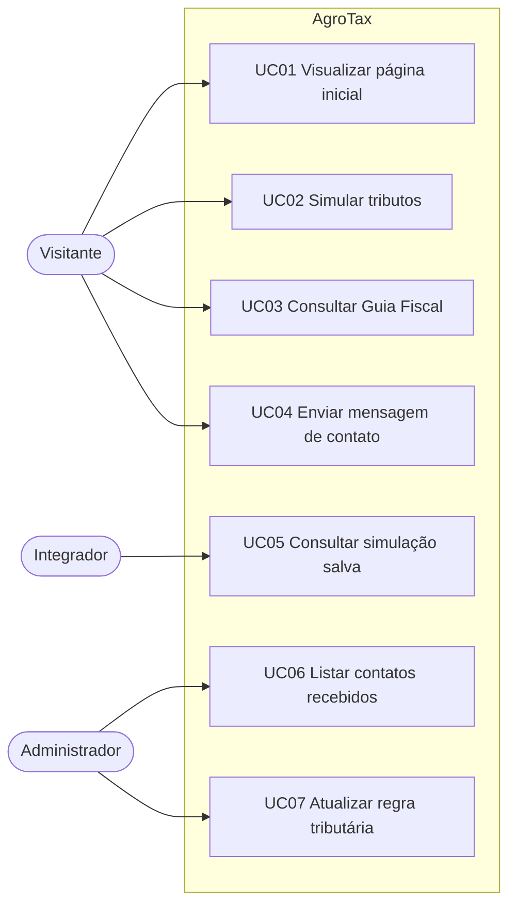
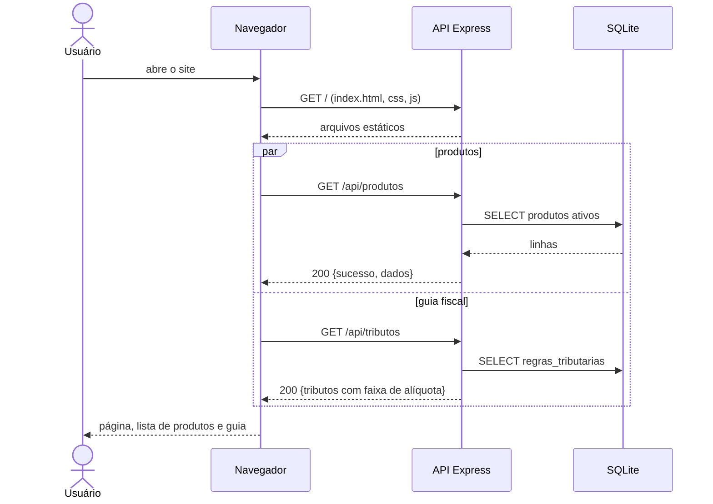
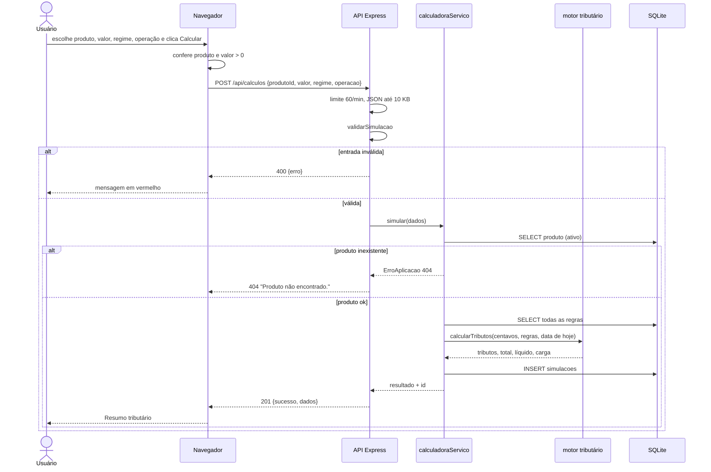
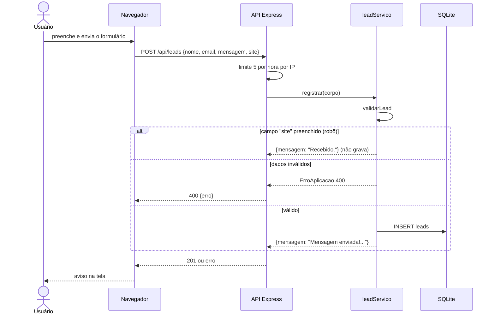
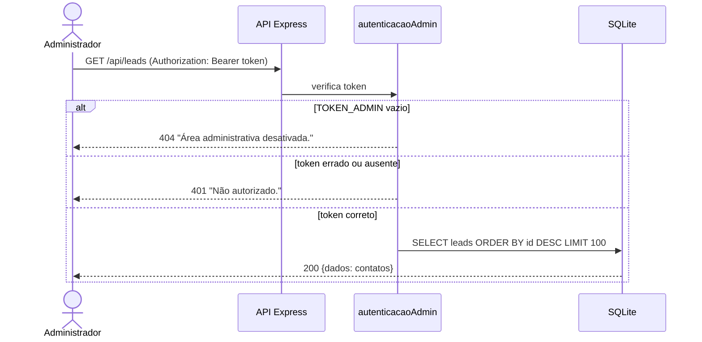
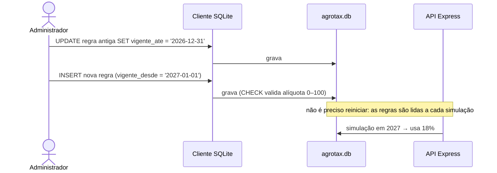

# Documento de Requisitos de Usuário — AgroTax

| Campo | Valor |
|---|---|
| **Sistema** | AgroTax — site e API de estimativa tributária para o agronegócio |
| **Versão do documento** | 1.0 |
| **Versão do sistema analisado** | `agrotax-api` 2.0.0 |
| **Normas de referência** | ISO/IEC/IEEE 29148:2018 (requisitos); casos de uso no estilo Cockburn; UML (diagramas em Mermaid) |
| **Idioma** | Português Brasileiro (pt-BR) |
| **Documentos relacionados** | `escopo_do_projeto.md`, `historias_de_usuario.md` (HU), `requisitos_de_sistema.md` (RSF/RNF), `plano_de_testes.md`, `matriz_de_rastreabilidade.md` |

> **Nota metodológica.** Os requisitos descrevem o comportamento **verificado no código** (front-end em `front-end/js`,
> API em `API/src`). Mensagens entre aspas são os textos reais exibidos pelo sistema. As personas são **ilustrativas**
> (não resultam de pesquisa com usuários reais). O que ainda não existe aparece como **[PROPOSTO]**.

---

## Sumário

1. Visão geral e objetivos do usuário
2. Perfis de usuário (atores) e personas
3. Requisitos de usuário (RU)
4. Diagrama de casos de uso
5. Especificação dos casos de uso (UC)
6. Regras de negócio (RN)
7. Diagramas de sequência (perspectiva do usuário)
8. Mensagens do sistema
9. Glossário e convenções
10. Rastreabilidade RU ↔ UC ↔ HU

---

## 1. Visão geral e objetivos do usuário

O AgroTax permite que o usuário, em poucos cliques, escolha um **produto agrícola**, informe o **valor da operação**,
o **regime tributário** e o **tipo de operação** (compra ou venda) e receba uma **estimativa** dos tributos incidentes,
com total, valor líquido e carga tributária percentual. Também oferece um **Guia Fiscal** explicativo e um
**formulário de contato**. A equipe administra os contatos e as alíquotas.

| Objetivo do usuário | Atendido por |
|---|---|
| "Quero saber quanto de imposto pesa nessa operação" | UC02 |
| "Quero entender o que é cada tributo" | UC03 |
| "Quero falar com a equipe" | UC04 |
| "Quero rever uma simulação que fiz" | UC05 (via API) |
| "Preciso ler os contatos recebidos" | UC06 |
| "A lei mudou: preciso atualizar a alíquota" | UC07 |

---

## 2. Perfis de usuário (atores) e personas

| Ator | Descrição | Acesso | Casos de uso |
|---|---|---|---|
| **Visitante / Usuário** | Qualquer pessoa que abre o site; não há cadastro nem login | Público | UC01, UC02, UC03, UC04 |
| **Integrador** | Desenvolvedor que consome a API diretamente | Público (API) | UC05 |
| **Administrador** | Integrante da equipe que conhece o `TOKEN_ADMIN` e o banco | Token (leads); acesso ao arquivo do banco | UC06, UC07 |
| **Sistema** | Executa validações, cálculo e persistência | — | Todos |

### Personas ilustrativas

| Persona | Perfil | Necessidade | Dor atual |
|---|---|---|---|
| **Carlos, produtor rural (PF)** | Vende soja e milho; usa o celular no campo | Saber quanto sobra após Funrural e SENAR numa venda | Depende do contador para qualquer conta |
| **Marina, contadora** | Atende vários produtores e cooperativas | Ter uma primeira estimativa rápida para orientar o cliente | Refaz planilhas a cada regime e operação |
| **Lucas, estudante de agronegócio** | Estuda tributação agrícola | Entender cada tributo e como o regime muda o resultado | Material espalhado e técnico demais |

---

## 3. Requisitos de usuário (RU)

Prioridade pelo método MoSCoW. Situação conferida no código.

| ID | Requisito de usuário | Prioridade | Situação | Casos de uso |
|---|---|---|---|---|
| RU01 | O usuário deve conhecer a proposta do AgroTax e navegar entre Início, Calculadora, Guia Fiscal e Sobre | Must | Implementado | UC01 |
| RU02 | O usuário deve escolher o produto da operação em uma lista de produtos cadastrados | Must | Implementado e testado | UC02 |
| RU03 | O usuário deve informar o valor da operação, o regime tributário e o tipo de operação | Must | Implementado e testado | UC02 |
| RU04 | O usuário deve ver o valor de cada tributo, o total, o valor líquido e a carga tributária (%) | Must | Implementado e testado | UC02 |
| RU05 | O usuário deve ser informado, em todas as telas de resultado, de que o valor é uma estimativa | Must | Implementado (verificação manual pendente) | UC01, UC02 |
| RU06 | O usuário deve consultar um Guia Fiscal com a descrição de cada tributo e a faixa de alíquotas vigentes | Should | Implementado e testado | UC03 |
| RU07 | O usuário deve enviar uma mensagem de contato com nome, e-mail e texto | Should | Implementado e testado | UC04 |
| RU08 | O integrador deve consultar uma simulação já realizada pelo seu identificador | Could | Implementado e testado (somente API) | UC05 |
| RU09 | O administrador deve consultar os contatos recebidos | Should | Implementado e testado | UC06 |
| RU10 | O administrador deve atualizar alíquotas quando a lei mudar, sem alterar o código | Must | Implementado (via SQL); painel **[PROPOSTO]** | UC07 |
| RU11 | O usuário deve usar o site em celular e computador | Should | Implementado (verificação manual pendente) | UC01, UC02 |
| RU12 | O usuário deve receber mensagens de erro claras quando algo estiver incorreto ou indisponível | Must | Implementado e testado (regras); apresentação verificada manualmente | UC02, UC04 |
| RU13 | O usuário deve poder ver o identificador da simulação na tela e rever o histórico | Won't (esta versão) | **[PROPOSTO]** | — |
| RU14 | O usuário deve poder exportar a simulação em PDF | Won't (esta versão) | **[PROPOSTO]** | — |

---

## 4. Diagrama de casos de uso

---

## 5. Especificação dos casos de uso (UC)

### UC01 — Visualizar página inicial

| Item | Descrição |
|---|---|
| **Ator** | Visitante |
| **Requisitos** | RU01, RU05, RU11 |
| **Pré-condição** | Servidor no ar |
| **Pós-condição** | Página exibida; guia fiscal e produtos carregados em segundo plano |
| **Fluxo principal** | 1. O usuário abre o endereço do site. 2. O sistema entrega `index.html`, estilos e módulos JS. 3. O sistema exibe o título "Simplifique a sua estimativa tributária", o aviso de que os resultados são estimativas e os botões "Abrir calculadora" e "Conhecer o guia fiscal". 4. Em paralelo, o front-end carrega a lista de produtos e o guia fiscal (UC02 e UC03). |
| **Fluxo alternativo A1** | O usuário usa o menu (Início, Calculadora, Guia Fiscal, Sobre) ou os botões: a página rola até a seção correspondente. |
| **Exceção E1** | Em tela pequena (até 820 px), o menu superior é ocultado e o botão "Calcular agora" permanece. |

### UC02 — Simular tributos

| Item | Descrição |
|---|---|
| **Ator** | Visitante |
| **Requisitos** | RU02, RU03, RU04, RU05, RU12 |
| **Pré-condição** | Produtos cadastrados e ativos |
| **Pós-condição (sucesso)** | Simulação gravada em `simulacoes` e resumo tributário exibido |
| **Pós-condição (falha)** | Nada é gravado; mensagem de erro exibida |
| **Regras** | RN01 a RN08 |

**Fluxo principal**

1. O usuário vai até a seção "Faça sua simulação".
2. O sistema preenche o campo Produto (`GET /api/produtos`) e a lista de regimes (Lucro Presumido, Lucro Real, Simples Nacional, Produtor Rural PF).
3. O usuário escolhe o produto, digita o valor (R$), escolhe o regime e o tipo de operação (Compra ou Venda).
4. O usuário clica em "Calcular tributos".
5. O front-end confere que há produto escolhido e valor maior que zero.
6. O botão passa a "Calculando…" e fica desabilitado; o front-end envia `POST /api/calculos`.
7. O servidor valida a entrada (RN05), localiza o produto, escolhe as regras vigentes e mais específicas (RN01, RN02), calcula em centavos (RN07) e grava a simulação.
8. O sistema exibe o **Resumo tributário**: total, carga estimada, valor líquido, uma linha por tributo (alíquota, observação e valor) e o rodapé "Estimativa — confirme com um contador."
9. O botão volta a "Calcular tributos".

**Fluxos alternativos**

| ID | Condição | Comportamento |
|---|---|---|
| A1 | Produto não selecionado | Aviso "Selecione um produto."; nada é enviado |
| A2 | Valor vazio, zero ou negativo | Aviso "Informe um valor maior que zero."; nada é enviado |
| A3 | Tributo sem regra para a combinação | Valor 0 e observação "Sem regra cadastrada" (RN03) |

**Exceções**

| ID | Condição | Comportamento |
|---|---|---|
| E1 | Falha ao carregar produtos | Campo mostra "Não foi possível carregar os produtos" e um aviso é exibido |
| E2 | Servidor rejeita a entrada (400) | Mensagem em vermelho no painel de resultado (ex.: "Informe um valor da operação entre R$ 0,01 e R$ 1 trilhão.") |
| E3 | Produto inexistente ou inativo (404) | "Produto não encontrado." |
| E4 | Mais de 60 simulações por minuto no mesmo IP (429) | "Muitas requisições. Aguarde um instante." |
| E5 | Erro interno (500) | "Erro interno do servidor." (detalhe só no log) |
| E6 | Servidor fora do ar | Mensagem de erro de rede no painel de resultado |

### UC03 — Consultar Guia Fiscal

| Item | Descrição |
|---|---|
| **Ator** | Visitante |
| **Requisitos** | RU06 |
| **Pré-condição** | Regras tributárias cadastradas |
| **Fluxo principal** | 1. Ao abrir a página, o front-end chama `GET /api/tributos`. 2. O sistema devolve, para cada um dos 6 tributos, rótulo, descrição e menor e maior alíquota **vigentes hoje**. 3. O front-end desenha um cartão por tributo, com "Alíquotas cadastradas: X%" ou "X% a Y%". |
| **Exceção E1** | Falha na chamada: a seção mostra "Não foi possível carregar o guia agora." |

### UC04 — Enviar mensagem de contato

| Item | Descrição |
|---|---|
| **Ator** | Visitante |
| **Requisitos** | RU07, RU12 |
| **Pós-condição** | Lead gravado em `leads` |
| **Fluxo principal** | 1. Na seção "Sobre", o usuário preenche nome, e-mail e mensagem. 2. Clica em "Enviar mensagem". 3. O front-end envia `POST /api/leads`. 4. O servidor valida (nome 2–100, e-mail válido até 254, mensagem 5–1000 caracteres), normaliza (remove espaços, e-mail em minúsculas) e grava. 5. O sistema mostra "Mensagem enviada! Entraremos em contato." e limpa o formulário. |
| **Alternativo A1 (robô)** | Se o campo escondido "site" vier preenchido, o sistema responde sucesso ("Recebido.") **sem gravar**. |
| **Exceção E1** | Dados inválidos (400): o aviso mostra os motivos (ex.: "Informe um e-mail válido."). |
| **Exceção E2** | Mais de 5 envios por hora no mesmo IP (429): "Muitas requisições. Aguarde um instante." |
| **Nota de privacidade** | O formulário informa: "Usamos seu nome e e-mail apenas para responder a esta mensagem." |

### UC05 — Consultar simulação salva

| Item | Descrição |
|---|---|
| **Ator** | Integrador (via API) |
| **Requisitos** | RU08 |
| **Fluxo principal** | 1. O integrador chama `GET /api/calculos/{id}`. 2. O sistema devolve a simulação (valores em centavos e o resultado completo). |
| **Exceção E1** | Id inexistente ou não numérico: 404 "Simulação não encontrada." |
| **Observação** | O id é sequencial e não exige autenticação (lacuna L-04). A interface web ainda não exibe o id (RU13 **[PROPOSTO]**). |

### UC06 — Listar contatos recebidos

| Item | Descrição |
|---|---|
| **Ator** | Administrador |
| **Requisitos** | RU09 |
| **Pré-condição** | Variável `TOKEN_ADMIN` definida no servidor |
| **Fluxo principal** | 1. O administrador chama `GET /api/leads` com o cabeçalho `Authorization: Bearer <TOKEN_ADMIN>`. 2. O sistema compara o token em tempo constante. 3. Devolve até 100 contatos, do mais recente para o mais antigo. |
| **Exceção E1** | Token ausente ou errado: 401 "Não autorizado." |
| **Exceção E2** | `TOKEN_ADMIN` vazio: 404 "Área administrativa desativada." |

### UC07 — Atualizar regra tributária

| Item | Descrição |
|---|---|
| **Ator** | Administrador |
| **Requisitos** | RU10 |
| **Pré-condição** | Acesso ao arquivo do banco (`API/dados/agrotax.db`) e a um cliente SQLite |
| **Fluxo principal** | 1. O administrador fecha a vigência da regra antiga (`UPDATE ... SET vigente_ate = 'AAAA-MM-DD'`). 2. Insere a nova regra com `vigente_desde` na data de início. 3. A partir dessa data, simulações e Guia Fiscal passam a usar a nova alíquota; simulações antigas permanecem como foram gravadas. |
| **Exceção E1** | Alíquota fora de 0–100 ou tributo inválido: o banco rejeita (`CHECK`). |
| **Observação** | Exemplo completo em `banco-de-dados.md`. Painel gráfico: **[PROPOSTO]**. |

---

## 6. Regras de negócio (RN)

| ID | Regra | Onde é aplicada |
|---|---|---|
| RN01 | Para cada tributo vale a regra **vigente na data da simulação**: `vigente_desde ≤ data ≤ vigente_ate` (ou sem fim) | `calculadoraTributaria.js` |
| RN02 | Havendo várias regras possíveis, vence a **mais específica**: produto (4 pontos) > regime (2) > operação (1); empate: a de `vigente_desde` mais recente | `calculadoraTributaria.js` |
| RN03 | Tributo sem regra aplicável resulta em 0 e observação "Sem regra cadastrada" | `calculadoraTributaria.js` |
| RN04 | Na base inicial, Funrural e SENAR existem **somente** para Produtor Rural PF em **Venda**; PIS e COFINS dependem do regime (zero para Simples Nacional e Produtor Rural PF). É regra de **dados**, não de código | `dados_iniciais.sql` |
| RN05 | Valor da operação: número de R$ 0,01 até R$ 1 trilhão; regime e operação devem estar nas listas oficiais; produto deve ser inteiro positivo | `validadores.js` |
| RN06 | Alíquotas não são sobrescritas: mudança de lei = nova regra com nova data de início | processo (ver UC07) |
| RN07 | Valores monetários são calculados e gravados em **centavos inteiros** (`Math.round`) | `calculadoraTributaria.js`, `calculadoraServico.js` |
| RN08 | Produto inativo (`ativo = 0`) não aparece na lista e não pode ser simulado | `produtoModelo.js` |
| RN09 | Carga tributária (%) = total ÷ valor × 100, com 2 casas; valor líquido = valor − total | `calculadoraTributaria.js` |
| RN10 | Todos os resultados são **estimativas** e não substituem um contador | textos do front-end |
| RN11 | Um contato com o campo armadilha preenchido não é gravado | `leadServico.js` |

---

## 7. Diagramas de sequência (perspectiva do usuário)

### DS-01 — Carregar a página

### DS-02 — Simular tributos (fluxo principal)

### DS-03 — Enviar contato (com proteção contra robô)

### DS-04 — Administrador lista contatos

### DS-05 — Administrador atualiza uma alíquota

---

## 8. Mensagens do sistema

| Origem | Mensagem | Quando |
|---|---|---|
| Front-end | "Selecione um produto." | Produto não escolhido |
| Front-end | "Informe um valor maior que zero." | Valor ≤ 0 ou vazio |
| API (validação) | "Selecione um produto válido." | `produtoId` inválido |
| API (validação) | "Informe um valor da operação entre R$ 0,01 e R$ 1 trilhão." | Valor fora da faixa |
| API (validação) | "Regime tributário inválido." / "Tipo de operação inválido." | Valor fora da lista |
| API (validação) | "Informe seu nome (2 a 100 caracteres)." | Nome curto ou longo |
| API (validação) | "Informe um e-mail válido." | E-mail fora do padrão |
| API (validação) | "A mensagem deve ter de 5 a 1000 caracteres." | Mensagem curta ou longa |
| API | "Produto não encontrado." / "Simulação não encontrada." | 404 |
| API | "Rota não encontrada." | 404 em `/api/*` |
| API | "JSON inválido." | Corpo malformado (400) |
| API | "Requisição grande demais." | Corpo > 10 KB (413) |
| API | "Muitas requisições. Aguarde um instante." | Limite excedido (429) |
| API | "Não autorizado." / "Área administrativa desativada." | 401 / 404 |
| API | "Erro interno do servidor." | 500 |
| Sucesso | "Mensagem enviada! Entraremos em contato." | Contato gravado |

---

## 9. Glossário e convenções

| Termo | Definição |
|---|---|
| **ICMS** | Imposto estadual sobre circulação de mercadorias e serviços |
| **IPI** | Imposto federal sobre produtos industrializados; produtos in natura costumam não ser tributados |
| **PIS / COFINS** | Contribuições federais calculadas conforme o regime (cumulativo ou não cumulativo) |
| **Funrural** | Contribuição previdenciária do produtor rural sobre a receita bruta da comercialização |
| **SENAR** | Contribuição ao Serviço Nacional de Aprendizagem Rural sobre a comercialização |
| **NCM** | Nomenclatura Comum do Mercosul: código que classifica o produto |
| **Regime tributário** | Forma de tributação do contribuinte: Simples Nacional, Lucro Presumido, Lucro Real ou Produtor Rural PF |
| **Alíquota** | Percentual aplicado sobre o valor da operação |
| **Carga tributária** | Total de tributos dividido pelo valor da operação, em % |
| **Vigência** | Período em que uma regra vale (`vigente_desde` até `vigente_ate`) |
| **Regra mais específica** | Regra que menciona produto, regime e/ou operação, em vez de valer para todos (`*`) |
| **Centavos inteiros** | Representação do dinheiro em números inteiros para evitar erros de ponto flutuante |
| **Lead** | Contato deixado pelo visitante no formulário (nome, e-mail, mensagem) |
| **Honeypot (campo armadilha)** | Campo invisível ao humano; robôs o preenchem e são descartados |
| **Limite de requisições** | Máximo de chamadas por IP em um período |
| **CSP** | Política de segurança de conteúdo: define de onde o navegador pode carregar scripts e estilos |
| **CORS** | Mecanismo que define quais sites podem chamar a API |
| **Token administrativo** | Segredo (`TOKEN_ADMIN`) que autoriza a consulta de contatos |
| **Endpoint** | Endereço da API (método + URL) |
| **[PROPOSTO]** | Item que ainda não existe no código |

---

## 10. Rastreabilidade RU ↔ UC ↔ HU

| RU | Casos de uso | Histórias de usuário |
|---|---|---|
| RU01 | UC01 | HU01, HU02 |
| RU02 | UC02 | HU03 |
| RU03 | UC02 | HU04 |
| RU04 | UC02 | HU05, HU06 |
| RU05 | UC01, UC02 | HU07 |
| RU06 | UC03 | HU10, HU11 |
| RU07 | UC04 | HU12, HU13 |
| RU08 | UC05 | HU16 |
| RU09 | UC06 | HU14 |
| RU10 | UC07 | HU15 |
| RU11 | UC01, UC02 | HU09 |
| RU12 | UC02, UC04 | HU08 |
| RU13 | — | HU21 |
| RU14 | — | HU22 |
